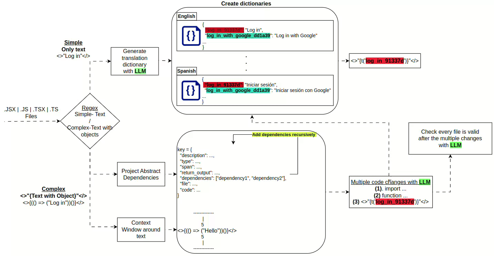

# React i18n Automation System

This project implements an automated internationalization (i18n) system that uses Large Language Models (LLM) to identify, extract, and translate user-facing strings in React projects. The system processes JSX/JS/TSX/TS files, categorizes string patterns, and generates comprehensive translation dictionaries with intelligent context analysis.

## Table of Contents

1. [Overview](#overview)
2. [High Level Logic](#high-level-logic)
3. [Fine Grained Logic](#fine-grained-logic)
   - [File Processing & Pattern Recognition](#file-processing--pattern-recognition)
   - [Simple String Processing](#simple-string-processing)
   - [Complex String Processing](#complex-string-processing)
   - [Translation Generation](#translation-generation)
   - [Code Validation](#code-validation)
4. [Components](#components)
5. [Assumptions](#assumptions)
6. [Getting Started](#getting-started)
   - [Prerequisites](#prerequisites)
   - [Installation](#installation)
7. [Tools & Technologies](#tools--technologies)
8. [Limitations](#limitations--tests)
9. [License](#license)

## Overview

The system automatically scans React projects to identify user-facing strings that require internationalization. It uses regex pattern matching to categorize strings into "simple" (plain text) and "complex" (containing objects or function calls) categories. For simple strings, it generates direct translations using LLM. For complex strings, it performs dependency analysis to understand the context and generates appropriate translation mappings.

---
.

## High Level Logic

1. **File Scanning:**  
   The system processes JSX/JS/TSX/TS files throughout the React project structure.

2. **Pattern Recognition:**  
   Regex patterns identify two types of translatable content:
   - **Simple Strings:** `<>"..."</>`
   - **Complex Strings:** `<>{...}</>`

3. **Context Analysis:**  
   For complex strings, the system analyzes dependencies and surrounding code context to understand the string generation logic.


4. **Translation Dictionary Generation:**  
   LLM generates appropriate translations and i18n keys for identified strings.

5. **Code Validation:**  
   Final LLM validation ensures all modified files contain valid, functional code.

---

## Fine Grained Logic

### **File Processing & Pattern Recognition:**
   - The system scans all React files (JSX, JS, TSX, TS) in the project directory
   - Regex patterns identify user-facing strings in JSX syntax:
     - **Simple pattern:** Direct text content `<>text</>`
     - **Complex pattern:** Object/function expressions `<>{expression}</>`
   - Each identified string is categorized and marked for processing


### **Simple String Processing:**
   - Plain text strings are extracted directly from JSX content
   - Strings are sent to LLM with context for translation key generation
   - Translation dictionary is populated

### **Complex String Processing:**
   - All project's object expressions and function calls are analyzed for string dependencies
   - AST (Abstract Syntax Tree) creation maps variable dependencies and function calls
   - Dependency dictionary tracks:
     - Function definitions that return strings
     - Constants used in string construction
     - Variable assignments affecting string output
   - Context window around designated lines provides LLM with sufficient information
   - System identifies all locations requiring changes for proper i18n implementation

### **Translation Generation:**
   - Simple strings: Direct LLM translation 
   - Complex strings:
   - LLM analyzes dependencies and with context awareness for suggests refactoring approach
   - Translation keys follow consistent naming conventions
   - Multiple language support based on project configuration
   - Validation ensures translations maintain original meaning and context

## Components

- **AST Creation (`ast_creation.py`):**  
  Generates bbstract dictionary for dependency analysis and code structure understanding.

- **Complex String Processor (`complex_i18n.py`):**  
  Manages object expressions and function call analysis for complex string patterns.

- **Configuration Manager (`config.py`):**  
  Handles project configuration, language settings, and processing parameters.

- **Change Application (`apply_complex_changes.py`):**  
  Applies generated translations and i18n modifications to source files.

- **i18n Agent (`i18n-agent_loc.py`):**  
  Main orchestrator that coordinates the entire internationalization process.

---

## Assumptions

- React project follows standard JSX/TSX conventions
- User-facing strings are contained within JSX elements
- Project uses or will integrate with react-i18next library
- LLM can generate contextually appropriate translations
- Code modifications preserve original functionality

---

## Getting Started

### Prerequisites
- Node.js version 16.0 or higher
- Python 3.8 or higher
- React project with JSX/TSX files

### Installation
1. **Clone the Repository:**
   ```bash
   git clone https://github.com/orlevit/react-internationalization.git
   cd react-internationalization
   ```

2. **Install Python dependencies:**
   ```bash
   pip install -r requirements.txt
   ```

3. **Install Node.js dependencies:**
   ```bash
   cd react-app
   npm install
   # or
   yarn install
   ```

4. **Configuration:**
   - Update `i18n_script/config.yaml` with your project settings
   - Set up your LLM API credentials in environment variables

5. **OpenAI API Key:**
   Create `.env` file with: `OPENAI_API_KEY=your_api_key`

6. **Usage:**
   ```bash
   # Run the i18n automation
   python i18n_script/i18n-agent_loc.py
   ```

---

## Tools & Technologies

- **Python** - Core automation logic
- **OpenAI GPT** - Translation and code analysis
- **React/Next.js** - Target framework
- **next-i18next** - Internationalization framework
- **Regex** - Pattern matching and string extraction

## Limitations

**Limitations:**
- Some dynamic string concatenations may not be detected
- Context-dependent translations may require manual adjustment
- Complex React patterns (HOCs, render props) need special handling

## License

This project is licensed under the MIT License. See the [LICENSE](LICENSE) file for details.
